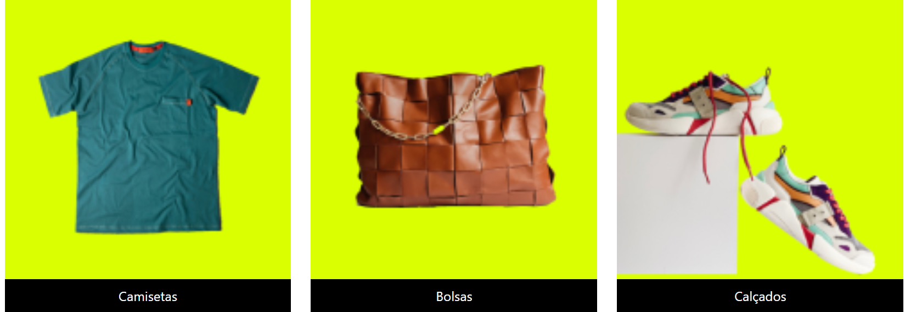
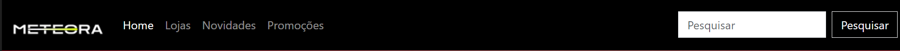

# Projeto Meteora


Projeto  e-commerce voltado para vestuários e acessórios.

## Índice 💡

- <a href="#funcionalidades">Funcionalidades do projeto</a>
- <a href="#layout">Layout</a>
- <a href="#demonstracao">Demonstração</a>
- <a href="#rodar">Como rodar este projeto ?</a>
- <a href="#autoras">Autores</a>
- <a href="#passos">Próximos passos</a>

## Funcionalidades do projeto 🎯

- [x] Catálogo de produtos : Apresentação de produtos disponíveis para compra com imagens, descrições,cores e preços.
- [x] Categorias e subcategorias:  Organização dos produtos em categorias e subcategorias para facilitar a navegação do usuário.
- [x] Filtros de Pesquisa: Permitir que os usuários filtrem os produtos por diferentes critérios, como preço, tamanho, cor, estilo, etc.
- [x] Facilidades: Opções de pagamentos, trocas e sustentabilidade.
- [x] Área de registro: Fornecer informações sobre novidades e promoções.


## Layout 💻







## Demonstração

[Link demonstração](https://projeto-bootstrap-jh39kurwl-simones-projects-82b7afd2.vercel.app/)

## Como rodar este projeto?

```bash
# Clone este repositório
$ git clone linkrepo

# Acesse a pasta do projeto  no seu terminal
$ cd nomepasta

# Instale as dependências
$ npm install

# Execute a aplicação
$npm run start


```

## Tecnologias Utilizadas ⚒


1. [Bootstrap](https://getbootstrap.com/docs/versions/)


## Autores 


[Linkedin](https://www.linkedin.com/in/smgabionetta/)

## Próximos Passos

- [ ] Área do cliente
- [ ] Promoções
